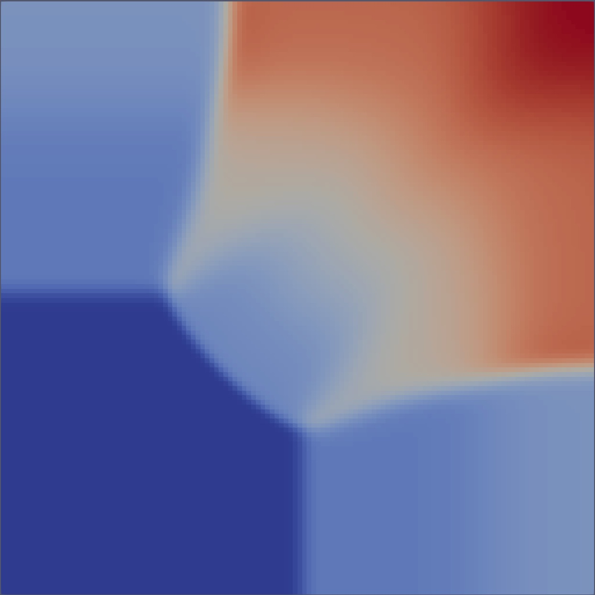
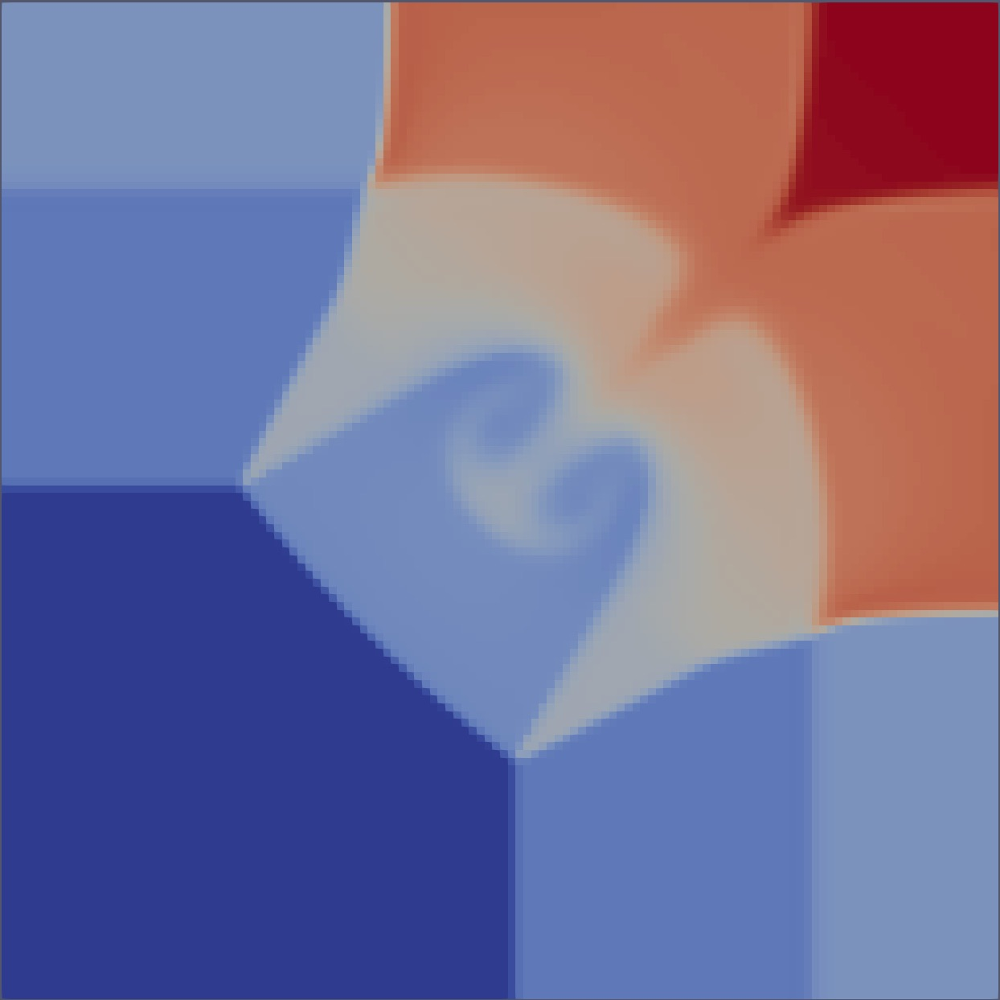

# Mars
This Code is intended to be used as a learning code and test bed for python optimisation via the numpy, numba, cython and scipy modules.

Mars is inspired by the code [PLUTO](http://plutocode.ph.unito.it/) and makes use of algorithms and from that project.

The code uses either a single or two step predictor corrector method to evolve the Euler equations in time in 1D, 2D, and 3D using

The code uses a single or two step predictor corrector method with an approximate Riemann solver, based on reconstructed fluid states of first or second order accuracy. This is achieved via a mix of the following algorithms:

| Name        | order |
| ----------- | ----- |
| **Time integration** |
| Euler       | 1st   |
| Runge-Kutta (RK2) | 2nd   |
| **Spacial reconstruction** |
| flat   | 1st   |
| linear | 2nd   |
| **Riemann solver** |
| tvdlf | most dissipative  |
| hll   | in the middle     |
| hllc  | least dissipative |

One from each category must be chosen and they are all compatible. If a user wants a very diffusive (but robust) combination of algorithms, they would choose 'Euler + flat + tvdlf'. Conversely, if they wanted a higher accuracy scheme, capable of capturing shocks they would choose 'RK2 + linear + hllc'. These two cases are illustrated below.

## Dependencies
* Python 3.5 or greater
* Numpy
* Numba
* vtk
* h5py
* cython (optional)

Using [Anaconda python](https://www.anaconda.com/distribution/) these dependencies can be installed using the cmd

    $ conda create --name mars  # This creates an conda env for mars to run in
    $ conda activate mars
    $ conda install -c anaconda numpy numba h5py cython # installs dependencies
    $ conda install -c e3sm evtk

## Running a problem script

Running a simulation with Mars is centered around executing a problem script, i.e.

    $ python problem.py

A collection of these scripts can be found under 'mars/problems/', they test the code in 1D, 2D and 3D using the reconstruction and Riemann solvers available.

## Todo
### Code Infrastructure
- [ ] Improve io class.
- [ ] Improve cython performance.
- [ ] Restart files.
- [ ] MPI
- [ ] Implement non regular grid
### Extra Physics
- [ ] Cooling Physics
- [ ] User source terms
- [ ] MHD
